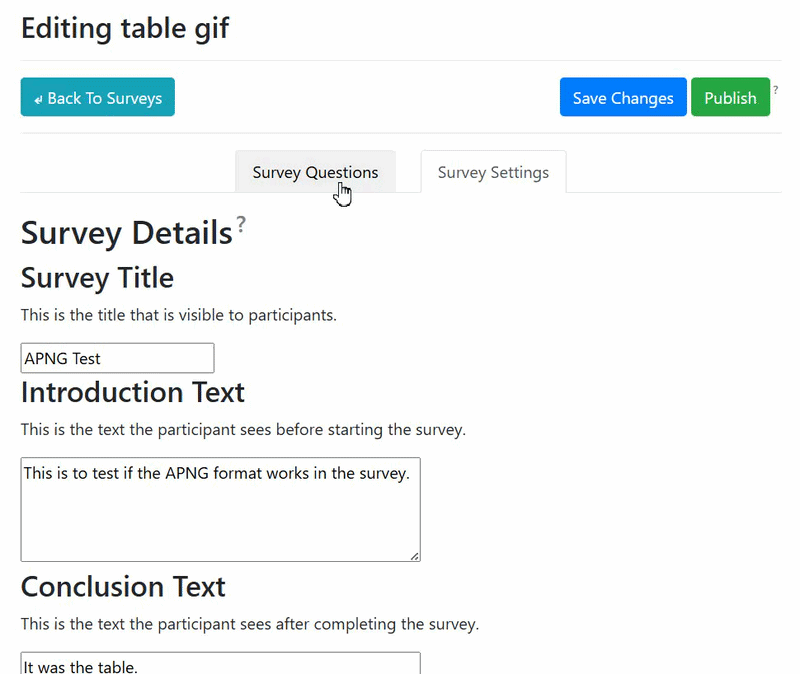
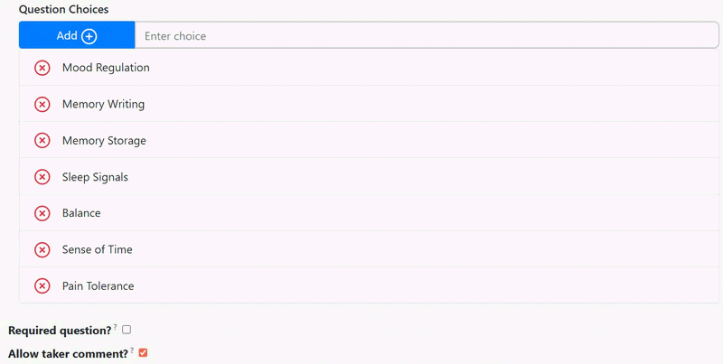
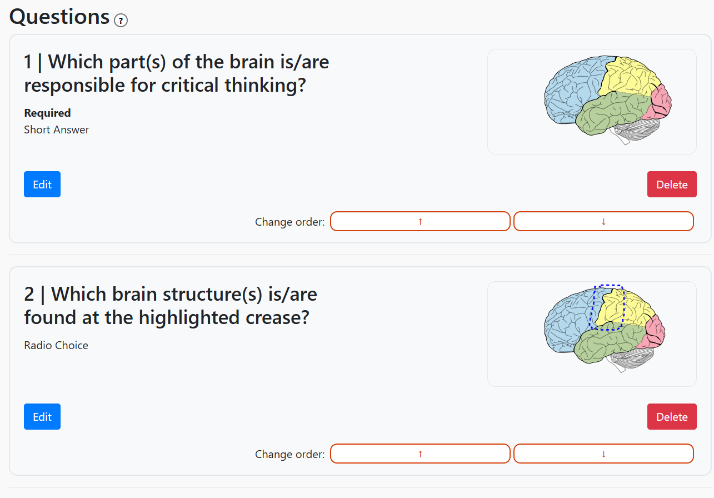

# [Repository](https://github.com/beheyx/Interactive-Survey-Tool-For-Data-Visualization-v2)

### Context

In my last year of my undergrad, the CS program where I went to had a required "year project" where you choose a project to work on for the whole year. I definitely wanted to avoid games since that was a big part of what I had done, and the topics around the research that I was doing at the time wasn't interesting to me.

I was interested in HCI and there were little opportunities for HCI, there was however one project that caught my attention for actually feeling as if my time studying human computer interaction was worth it and having something that I could experience as what someone in the field would be doing.

### Beginning

This project was in its second year when the team picked it up, with the existing repository not being... usable? Nothing was broken, it was just very awkward to use due to the lack of usability.

One overall glaring issue was that where the previous group left off on used a library called [Sakura](https://oxal.org/projects/sakura/) and was not appropriate for the scope of the whole system. Coincidentally, none of us on the team were comfortable familiar with webdev. All I knew at the time was that [Bootstrap](https://getbootstrap.com/) exists. On top of the existing Sakura, there were custom styles implemented for the main interface, so those were kept for functionality. That, as a result, led to some incompatibilities with Bootstrap that didn't affect the full situation.

_Overall, the backend had already existed. This year was all about improving both the frontend and the backend._

### Artifacts

To get started with the redesign of the user experience, each page had been broken down into its core components. This stayed the same but I then noticed that survey creation page had both the questions and settings on the same screen. Since these two functionalities would have different use cases, these were then separated into different tabs.

One thing that caught my attention was the options of multiple-choice style questions being a text input instructing users to type using a delimiter (in this case, `|` ). Since the backend only accepted string inputs, the options were converted to a deliminated format for the backend to receive.

Back to the main survey creation page, I noticed that there was no way to tell what visualization is being used! Then, a new iframe was added per question to display a static representation of the visualization used.

When it comes to unit testing, one requirement of the course was to implement unit testing. Trying to find the previous team's unit tests, I couldn't find any! Turns out, to fill that requirement, they used the github page building action. Yeah... we weren't even using the github page branch since we as a team had decided to put all of the page information onto the homepage of the project, instead of having a separate branch for the information requirement. Okay, let's just
[test to make sure it builds](https://github.com/beheyx/Interactive-Survey-Tool-For-Data-Visualization-v2/actions/runs/26939219461/job/79476259223), and then later added unit tests as they were created.

A lot of changes were smaller redesigns, as seen with the first gif and the last image in this section. Those question divs had very little information on it and its interactions were only accessible by going to the individual question page. That resulted in the redesign of the question divs to what it is now.

### Conclusion

Throughout the whole process, the main goal was to have the software be presentable to the general audience. This was a very difficult challenge since it was expected to have a very wide age demographic, meaning that people had to... understand the whole process.

There was one individual that went to the team that said something the stuck with me.

> Now, these are the projects that I like. It's such a simple concept yet I'm surprised that it hadn't been done before. It may not be as flashy as your peers' projects but I can see this actually being used in the future.

Or something like that, I'm writing this nearly two months after that event.

And, the project was done. It might go into a third year since the team had nobody familiar with cybersecurity. Looking at the question divs, I'd rather have the edit, ordering, and delete on the same line because there's a lot of whitespace. Oh well, the project is already wrapped up. :P

| Goal                         | Result                                                                                                                                                                                                       |
| ---------------------------- | ------------------------------------------------------------------------------------------------------------------------------------------------------------------------------------------------------------ |
| Redesign the User Experience | User testing showed no major usability bugs that were within our control. (One bug that stumped me specifically is that if an imported SVG using a font that the website doesn't have, it changes the font.) |
| Redesign the User Interface  | Stakeholders were satisfied with the new professional appearance.                                                                                                                                            |
| Present the User Experience  | For the event specifically, it was unfortunately only focused on the "taking-a-survey" side, since that is more mentally digestible than the "creating-a-survey" side.                                       |
